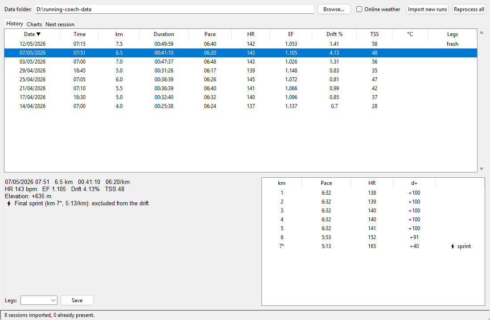
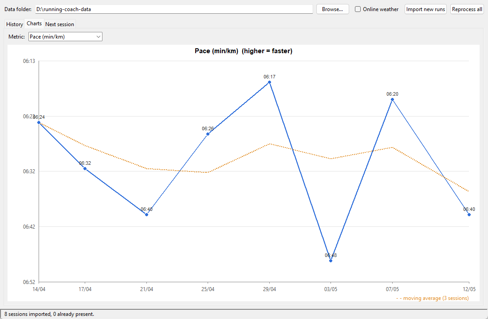

# running-coach

Command-line analyzer for running sessions exported from [intervals.icu](https://intervals.icu).
It reads the activity CSV, computes a few training-load metrics, and keeps a local history so
each new session can be compared with the previous ones.




The screenshots use synthetic runs generated by `tests/synth.py`, not real activities.

## Metrics

- **Efficiency Factor (EF)** — metres covered per heartbeat-per-minute (`distance_m / (avg_hr × minutes)`); higher means better aerobic efficiency.
- **Cardiac drift** — how much average heart rate rises from the first to the second half of the
  steady part of the run (%). The first 10 minutes (`WARMUP_S`) and an auto-detected final-km
  sprint are excluded. A high value points to fatigue, heat or dehydration.
- **TSS** — a training-stress score from duration and heart rate relative to threshold.
- **Elevation** — ascent/descent with a GPS-noise filter.

## GUI

```
py running-coach-gui.pyw        # or double-click the file (Windows opens it without a console)
```

Pick the data folder (the one with the `YYYY.MM.DD HH.MM-RUNNING.csv` files and `running_history.csv`;
it is remembered in `~/.running_coach_gui.json`), then:

- **Import new runs** analyses only the CSVs not yet in the history and asks how your legs feel
  after the newest one. **Reprocess all** recomputes every session (weather and legs are kept).
- **History** lists all sessions; select one to see the per-km splits, sprint note and weather, and
  change its leg condition.
- **Charts** plots distance, pace, heart rate, EF, drift or TSS over time with a 3-session moving average.
- **Next session** shows the recommended rest, distance and pace.

The GUI and the command line share the same logic (`parse_run_csv.py`) and the same history file.

## Command line


```
python parse_run_csv.py                  # process every "YYYY.MM.DD HH.MM-RUNNING.csv" in the folder
python parse_run_csv.py "file.csv"       # process a single file
python parse_run_csv.py --no-weather     # skip the Open-Meteo lookup
python parse_run_csv.py --data ..\\running-coach-data   # read CSVs and keep running_history.csv in another folder
```

1. Export the activity as CSV from intervals.icu.
2. Rename it to `YYYY.MM.DD HH.MM-RUNNING.csv` (date and start time of the run) and put it
   next to the script.
3. Run the script. It asks how your legs feel (fresh / ok / heavy / sore) and uses the answer
   in the recommendations for the next session.

It prints a per-km breakdown, EF, cardiac drift, TSS, automatic sprint detection (final km)
and recommendations for the next session (rest days, distance, pace), then appends or updates
the session in `running_history.csv`.

**Weather lookup.** For each session it queries the
[Open-Meteo](https://open-meteo.com) historical API with the **start coordinates** of the
activity to record temperature, humidity and wind. If the request fails the script continues
without weather data. Pass `--no-weather` (or set `FETCH_WEATHER = False`) if you do not want coordinates sent
to an external service.

## The history file

`running_history.csv` has one row per session with the columns `date` (dd/mm/yyyy), `time`, `dist_km`, `duration_hms`,
`pace_minkm`, `avg_hr_bpm`, `ef_m_beat`, `drift_pct`, `tss`, `temp_c`, `humidity_pct`, `wind_kmh` and `legs`
(`fresh`, `ok`, `heavy` or `sore`). Files written by earlier versions (Italian column names such as `data`, `orario`,
`gambe` and the values `fresche`, `pesanti`, `dolenti`) are read as they are and rewritten with the English names
the next time the history is saved.

## Configuration

Personal parameters are constants at the top of the script. Edit them to match your own values:

| Constant | Meaning |
|---|---|
| `THRESHOLD_HR` | Lactate-threshold heart rate (bpm) |
| `EF_BASELINE` | Baseline efficiency (m/beat) used as a reference |
| `FETCH_WEATHER` | Query Open-Meteo for weather (`--no-weather` disables it) |
| `DRIFT_LOW`, `DRIFT_HIGH`, `DRIFT_VERY_HIGH` | Drift thresholds (%) for the "good" / "high" / "very high" messages and the rest-day and distance adjustments |
| `WARMUP_S` | Seconds excluded from the start when computing cardiac drift |
| `NOISE_ELEV_M` | Elevation changes below this are ignored as GPS noise |
| `SPRINT_PACE_S`, `SPRINT_HR_BPM` | How much faster / higher than the median flags a sprint |

**Keeping data out of this repo.** Use `--data FOLDER` (or set the `RUNNING_COACH_DATA`
environment variable) to read the activity CSVs from, and write `running_history.csv` to, a
separate folder — for example a private data-only repository cloned next to this one.

## Tests

```
py -m unittest discover -s tests -v
```

`tests/synth.py` generates synthetic intervals.icu-style CSVs (doubled Samsung distance, GPS lockup
at the start, optional final-km sprint), so the logic can be checked without real data.

## Privacy

This repository contains code only. `.gitignore` excludes `*.csv`, `*.fit`, `*.tcx`, `*.gpx`
and `running_history.csv`, so activity exports, GPS tracks and your history never get committed.
Keep your own data files out of version control.

## Requirements

Python 3, standard library only (the charts are drawn on a Tkinter canvas, without matplotlib). The GUI needs Tkinter, which ships with the standard Python
installer on Windows and macOS (Linux: `sudo apt install python3-tk`).

## License

[MIT](LICENSE)
